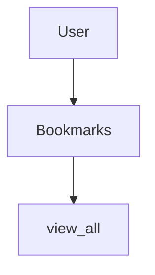
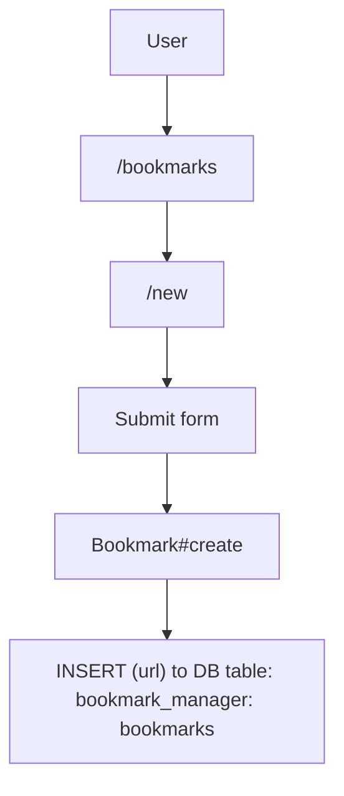
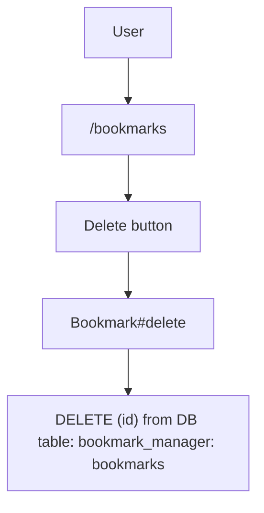
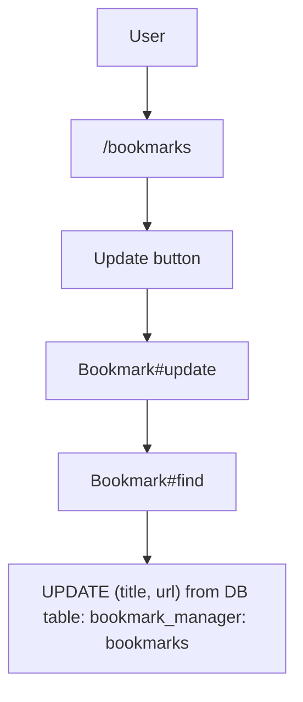
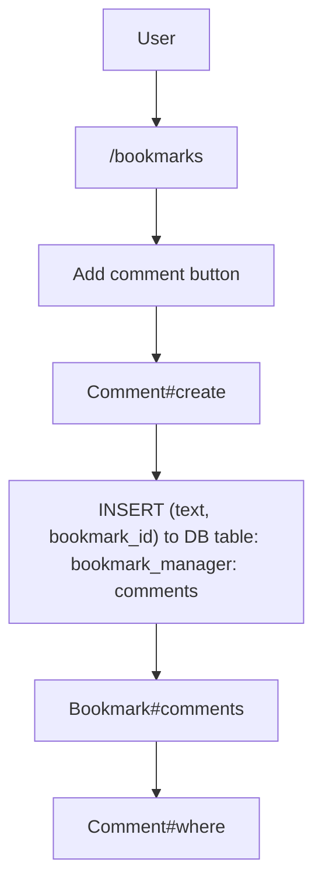

Bookmark Manager
=====

User Stories
-----
`As a user
So I can see my saved bookmarks
I would like to be able to view all bookmarks`

|  Objects        |  Messages      |
| ----------      | -------------  | 
| User |                        |
| Bookmarks |      view_all    |

`As a user
So I can store bookmarks
I would like to be able to input new bookmarks`

|  Objects        |  Messages      |
| ----------      | -------------  | 
| User            |                |
| Bookmarks       |   create       |

`As a user
So I can remove my bookwork from Bookmark Manager
I want to delete a bookmark`

|  Objects        |  Messages      |
| ----------      | -------------  | 
| User |                        |
| Bookmarks |      delete    |

`As a user
So I can update my bookmark from Bookmark Manager
I want to update a bookmark`

|  Objects        |  Messages      |
| ----------      | -------------  | 
| User            |                |
| Bookmarks       | find, update   |

`As a user
So I can see comments on my bookmarks from Bookmark Manager
I want to comment a bookmark`

|  Objects        |  Messages      |
| ----------      | -------------  | 
| User            |                |
| Bookmarks       | find, update   |
| Comment     | where, create  |

Database Setup
-----

1. Connect to `psql`
2. Create the database using the `psql` command `CREATE DATABASE bookmark_manager;`
3. Connect to the database using the `pqsl` command `\c bookmark_manager;`
4. Run the query we have saved in the file from the root directory by running `\i ./db/migrations/01_create_bookmarks_table.sql`
5. Run the query we have saved in the file from the root directory by running `\i ./db/migrations/02_add_title_to_bookmarks.sql`

Database Setup for Testing
-----

1. Connect to `psql`
2. Create the database using the `psql` command `CREATE DATABASE bookmark_manager_test;`
3. Connect to the database using the `pqsl` command `\c bookmark_manager_test;`
4. Run the query we have saved in the file from the root directory by running `\i ./db/migrations/01_create_bookmarks_table.sql`
5. Run the query we have saved in the file from the root directory by running `\i ./db/migrations/02_add_title_to_bookmarks.sql`

